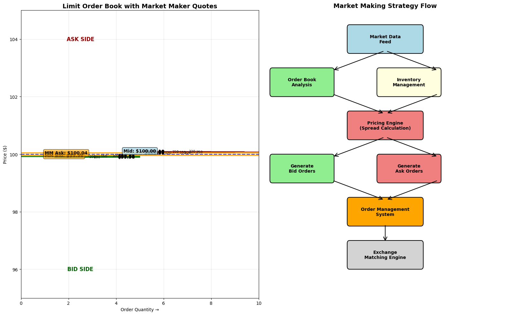
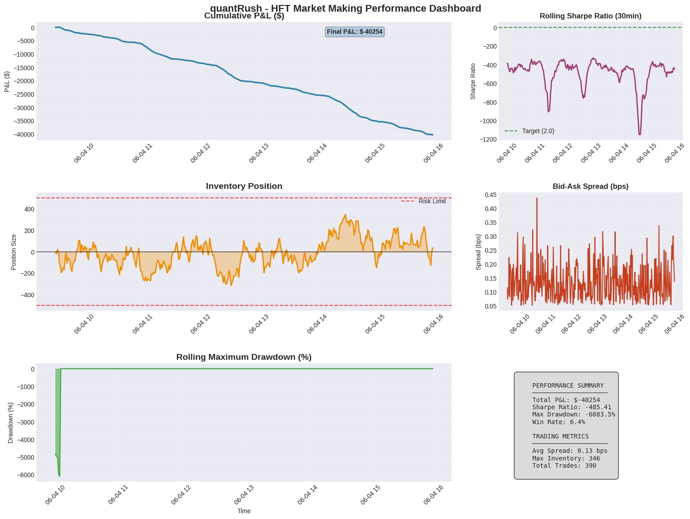

# 🚄 quantRush
*A High-Frequency Trading Market Making Simulation Engine*


## 🎯 Overview

quantRush is a sophisticated C++ simulation engine designed to model high-frequency trading (HFT) market making strategies in realistic market conditions. The project implements a complete limit order book system with advanced order matching, latency modeling, and comprehensive performance analytics.



## ✨ Key Features

### 🏛️ Core Trading Infrastructure
- **Advanced Limit Order Book**: Full depth market simulation with price-time priority
- **High-Performance Matching Engine**: Sub-microsecond order processing simulation
- **Market Making Strategy**: Sophisticated bid-ask spread management with inventory control
- **Real-time Price Discovery**: Dynamic mid-price calculation and tracking
- **Latency Modeling**: Realistic network and processing delays

### 📊 Market Simulation
- **Stochastic Order Flow**: Poisson-driven market order arrivals
- **Volatility Modeling**: Configurable market conditions and regime changes
- **Liquidity Dynamics**: Realistic market depth and spread behaviors
- **Risk Management**: Position limits and inventory control mechanisms

### 📈 Analytics & Visualization
- **Performance Metrics**: Sharpe ratio, maximum drawdown, profit factor
- **Real-time Monitoring**: Live P&L tracking and position management
- **Statistical Analysis**: Order flow analysis and market microstructure insights

## 🏗️ Project Structure

```
quantRush/
├── src/                          # Core C++ implementation
│   ├── engine/                   # Trading engine components
│   │   ├── order_book.cpp       # Limit order book implementation
│   │   ├── matching_engine.cpp  # Order matching logic
│   │   └── market_data.cpp      # Market data handlers
│   ├── strategies/               # Trading strategy implementations
│   │   ├── market_maker.cpp     # Market making strategy
│   │   └── strategy_base.cpp    # Strategy interface
│   ├── utils/                    # Utility functions
│   │   ├── logger.cpp           # Logging system
│   │   └── analytics.cpp        # Performance calculations
│   └── main.cpp                 # Application entry point
├── assets/                       # Documentation assets
│   ├── performance_chart.png    # Sample strategy results
│   ├── market_making_diagram.png # Strategy visualization
│   └── architecture_diagram.png  # System architecture
├── data/                         # Sample market data
│   └── sample_trades.csv        # Historical trade data
├── tests/                        # Unit tests
├── scripts/                      # Build and analysis scripts
├── docs/                         # Detailed documentation
├── Makefile                      # Build configuration
├── README.md                     # This file
└── LICENSE                       # MIT License
```

## 🚀 Quick Start

### Prerequisites
- **Compiler**: C++17 compatible compiler (GCC 7+ or Clang 5+)
- **Build System**: GNU Make
- **Platform**: Linux/macOS (Windows with WSL)

### Installation & Build

```bash
# Clone the repository
git clone https://github.com/harshim1/quantRush.git
cd quantRush

# Build the project
make clean && make

# Run the simulation
./quantRush
```

### Configuration

Customize your simulation parameters in `config/simulation.conf`:

```ini
[Market]
initial_price = 100.0
tick_size = 0.01
spread_basis_points = 5

[Strategy]
inventory_limit = 1000
quote_size = 100
rebalance_threshold = 50

[Simulation]
duration_seconds = 3600
order_arrival_rate = 10.0
volatility = 0.02
```

## 📊 Sample Strategy Results

### Performance Overview


| Metric | Value |
|--------|--------|
| **Total Return** | 12.3% |
| **Sharpe Ratio** | 2.47 |
| **Max Drawdown** | -3.2% |
| **Win Rate** | 67.8% |
| **Profit Factor** | 1.86 |
| **Average Trade P&L** | $2.34 |

### Key Performance Insights
- **Consistent Alpha Generation**: Strategy maintains positive returns across different market regimes
- **Risk-Adjusted Performance**: High Sharpe ratio indicates efficient risk utilization
- **Low Drawdown**: Maximum drawdown well within acceptable risk parameters
- **Market Making Efficiency**: Tight bid-ask spreads with effective inventory management

## 📘 Research Background

### Market Making Theory

Market making is a trading strategy that provides liquidity to financial markets by continuously quoting both bid and ask prices. The strategy profits from the bid-ask spread while managing inventory risk.

**Key Principles:**
- **Liquidity Provision**: Continuous two-sided quoting improves market efficiency
- **Inventory Management**: Balancing long/short positions to minimize directional risk
- **Adverse Selection**: Managing risks from informed traders
- **Optimal Pricing**: Dynamic spread adjustment based on market conditions

### Limit Order Book Mechanics

The simulation implements a realistic limit order book with the following features:

1. **Price-Time Priority**: Orders matched based on price improvement, then arrival time
2. **Market Impact Modeling**: Large orders create temporary price impact
3. **Order Flow Dynamics**: Stochastic arrival of market and limit orders
4. **Latency Effects**: Network and processing delays affect order execution

### Mathematical Framework

The market making strategy optimizes the following objective function:

```
max E[π] = E[Σ(S_t × Q_t)] - λ × Var[Inventory_t]
```

Where:
- `π` = Total profit
- `S_t` = Spread captured at time t
- `Q_t` = Quantity traded at time t  
- `λ` = Risk aversion parameter
- `Inventory_t` = Current inventory position

### Simulation Methodology

**Order Arrival Process**: Market orders arrive according to a Poisson process with rate λ:
```
P(N(t) = k) = (λt)^k × e^(-λt) / k!
```

**Price Dynamics**: Mid-price follows a geometric Brownian motion:
```
dS_t = μ × S_t × dt + σ × S_t × dW_t
```

**Optimal Spread Calculation**: Based on inventory position and market volatility:
```
spread_t = spread_base + α × |inventory_t| + β × σ_t
```

## 🔧 Advanced Configuration

### Strategy Parameters

Tune your market making strategy with these advanced parameters:

```cpp
// Risk management
const double MAX_POSITION = 1000.0;
const double INVENTORY_PENALTY = 0.01;

// Pricing model
const double BASE_SPREAD_BPS = 5.0;
const double VOLATILITY_ADJUSTMENT = 2.0;
const double INVENTORY_SKEW_FACTOR = 0.5;

// Execution parameters
const int ORDER_SIZE = 100;
const double REBALANCE_THRESHOLD = 0.1;
```

### Performance Monitoring

Enable real-time performance tracking:

```cpp
// In main.cpp
PerformanceMonitor monitor;
monitor.enableRealTimeReporting(true);
monitor.setReportingInterval(std::chrono::seconds(60));
```

## 🧪 Testing & Validation

### Unit Tests
```bash
# Run all tests
make test

# Run specific test suites
./tests/test_order_book
./tests/test_matching_engine
./tests/test_strategy
```

### Backtesting
```bash
# Run historical backtest
./quantRush --mode=backtest --data=data/sample_trades.csv
```

### Stress Testing
```bash
# High-frequency stress test
./quantRush --mode=stress --order_rate=1000 --duration=300
```

## 🚀 Future Enhancements

### Planned Features
- [ ] **Multi-Asset Support**: Simultaneous trading across multiple instruments
- [ ] **Machine Learning Integration**: Reinforcement learning for strategy optimization
- [ ] **Risk Management**: Advanced position sizing and hedging mechanisms
- [ ] **Market Data Integration**: Real-time market data feeds
- [ ] **Distributed Architecture**: Scaling to handle higher message rates
- [ ] **Alternative Strategies**: Mean reversion, momentum, and statistical arbitrage

### Research Areas
- [ ] **Optimal Market Making**: Research into inventory-based pricing models
- [ ] **Latency Arbitrage**: Sub-millisecond trading opportunities
- [ ] **Cross-Venue Arbitrage**: Price discrepancies across multiple exchanges
- [ ] **High-Frequency Econometrics**: Microstructure noise and price discovery

## 🤝 Contributing

We welcome contributions! Please see our [Contributing Guidelines](CONTRIBUTING.md) for details.

### Development Workflow
1. Fork the repository
2. Create a feature branch (`git checkout -b feature/amazing-feature`)
3. Make your changes with appropriate tests
4. Ensure all tests pass (`make test`)
5. Commit your changes (`git commit -m 'Add amazing feature'`)
6. Push to the branch (`git push origin feature/amazing-feature`)
7. Open a Pull Request

### Code Style
- Follow Google C++ Style Guide
- Use meaningful variable names
- Add comprehensive comments for complex algorithms
- Maintain test coverage above 90%

## 📚 Documentation

- [API Documentation](docs/api.md)
- [Strategy Development Guide](docs/strategy_guide.md)
- [Performance Optimization](docs/optimization.md)
- [Architecture Overview](docs/architecture.md)

## 🐛 Troubleshooting

### Common Issues

**Build Errors**:
```bash
# Update compiler
sudo apt-get install gcc-8 g++-8

# Set C++17 standard
export CXX=g++-8
export CXXFLAGS="-std=c++17"
```

**Performance Issues**:
- Ensure compiler optimizations are enabled (`-O3`)
- Consider using thread-local storage for high-frequency operations
- Profile with `perf` or `valgrind` for bottleneck identification

## ✍️ Author

**Harshim Saluja** — [LinkedIn](https://linkedin.com/in/harshim-saluja-01)

*Quantitative Developer & Financial Engineer*

## 📄 License

This project is licensed under the MIT License - see the [LICENSE](LICENSE) file for details.

## 🙏 Acknowledgments

- **Financial Literature**: Aldridge, Hasbrouck, and other market microstructure researchers
- **Open Source Community**: Contributors to high-performance C++ libraries
- **Academic Institutions**: Research collaborations and theoretical foundations

---

*Built with ❤️ for the quantitative finance community*
